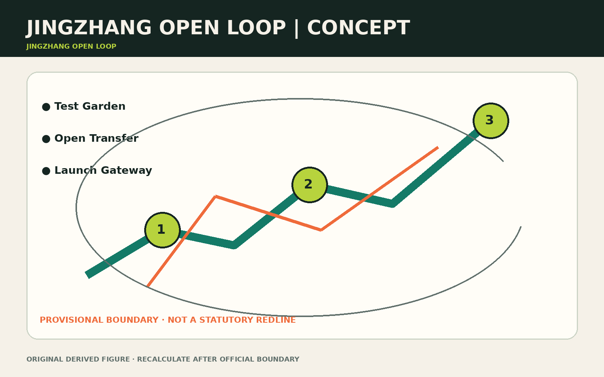
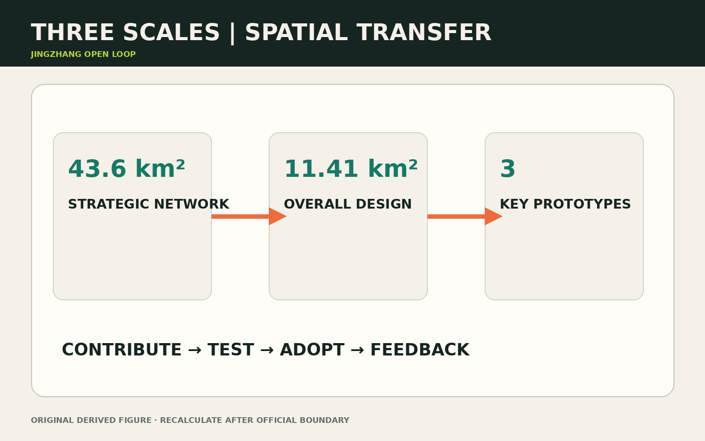
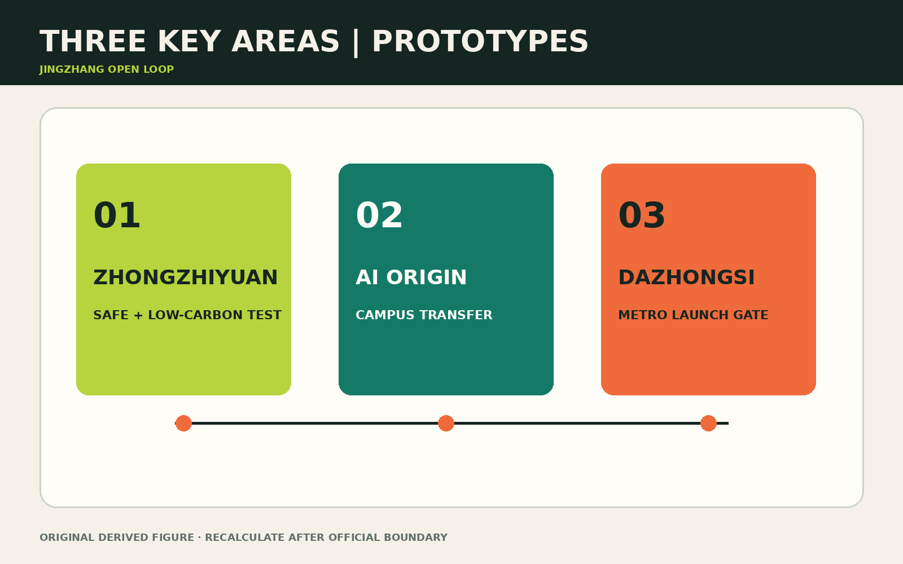
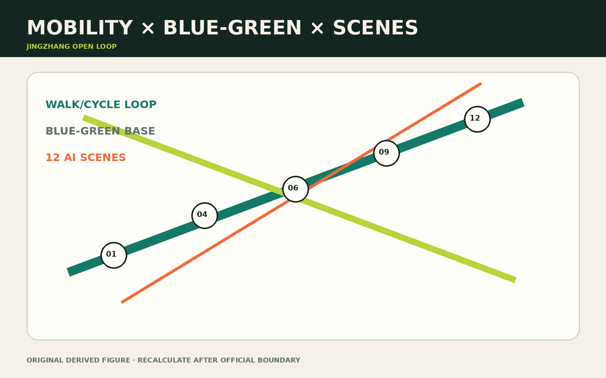
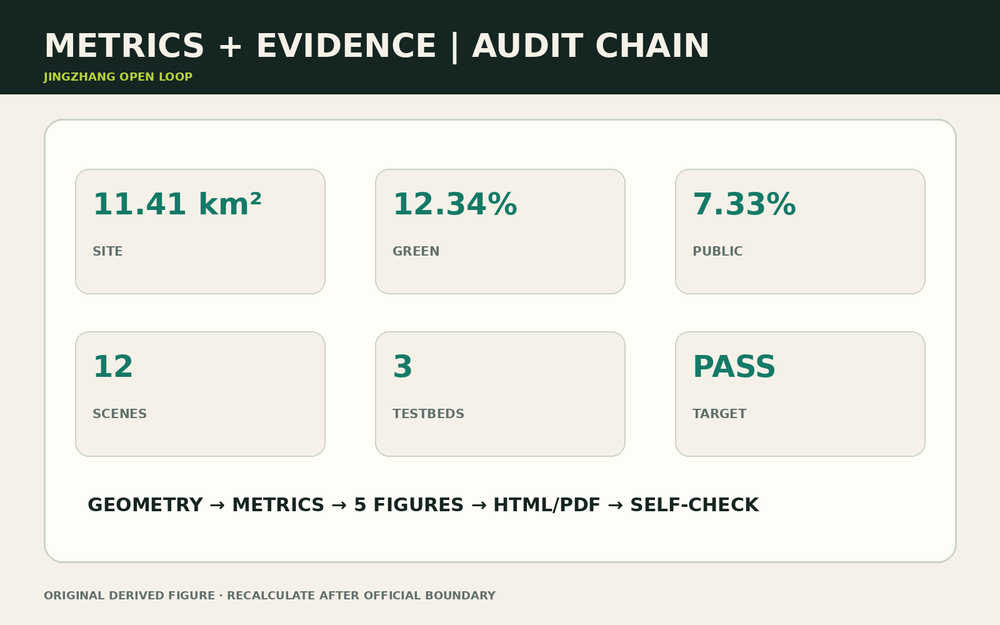

# JINGZHANG OPEN LOOP

> The project is not another technology corridor. Every contribution, test, spatial use and civic response must feed the next iteration. The loop is spatial, institutional, operational and social.

The Open Loop makes three public promises. It is **readable**: Chinese, English, pictogram, audio/easy-read and accessible formats explain what an AI suggestion can and cannot do. It is **questionable**: anyone can ask for the source, accountable person, confidence boundary and correction status. It is **reversible**: anyone can refuse identification, withdraw consent, switch to a person or stop a pilot. These rights appear in entrances, interfaces, tickets and staffing rosters; a checked terms box is not treated as meaningful choice.

## 01 Design Basis, Evidence Boundary and Diagnosis
The proposal follows the official announcement, agent taskbook and registered site package [source:OFFICIAL-ANNOUNCEMENT] [source:AGENT-TASKBOOK]. The submitted overall boundary and three key areas are provisional geometry, not statutory redlines. Land use, buildings, green/public space, phasing and metrics must be recalculated when official polygons arrive [data:geometry/site_boundary.geojson#SITE-001] [depth:risk_missing_data].

Four breaks shape the response: fragmented east–west access; weak research-to-test interfaces; dispersed enterprise/talent/resident services; and missing audit loops for AI use. One public axis, one service loop, three anchors and six renewal catalysts answer these gaps.

Sources are registered through four fields: source, permitted use, limitation and update action. The announcement defines scope; the taskbook defines scenarios and operating depth; the site package supports structured checks; public standards guide classification and professional language. Background-only and provisional-only material is never promoted to statutory evidence. The figures are an explanation layer; GeoJSON, metrics and matrices remain the recalculation layer [source:SOURCE-REGISTRY].

## 02 Three-Level Scope and Spatial Framework
The 43.6 km² strategic scope links universities, firms, communities and international networks. The approximately 11.41 km² design scope delivers spatial systems. Three key areas act as implementable prototypes [metric:site_area_sqm] [metric:key_area_count] [depth:three_level_scope_framework].

| Scale | Action | Verifiable output |
| --- | --- | --- |
| Strategic | contribution–test–adoption–feedback chain | annual issues, contribution ledger, scene register |
| Overall design | heritage-park axis plus knowledge stitches | land use, mobility, blue-green and service layers |
| Key areas | differentiated prototypes | test at Zhongzhiyuan, transfer at Origin, launch at Dazhongsi |

The loop uses existing streets, park paths, transit connections and civic nodes rather than claiming a new road redline [data:geometry/roads.geojson#ROAD-001] [standard:MOHURD-URBAN-DESIGN-MEASURES].

## 03 Coordinated Research Area: Industry and Future City

Four operating chains replace an all-inclusive resource map. Universities and open-source communities form the origination chain; Zhongzhiyuan supplies test conditions; firms and professional services form the transfer chain; and the heritage park plus Dazhongsi form the public communication chain. Public issues, test protocols, adoption cases and issue write-back connect them. Every annual issue names a technical maintainer, spatial host, public-interest statement and exit condition [depth:overall_spatial_structure].

The future city is defined by low-threshold entry, explainable use, retractable participation and maintainable service. R&D spaces support shared testing and compliance; living spaces preserve accessibility and human fallback; public spaces preserve non-identifying passage; cultural spaces preserve correctable narratives. International talent is supported by an open knowledge network, stable everyday services, multilingual arrival and visible contribution—not by a closed enclave [source:AGENT-TASKBOOK].

### Public Interface Protocol and Provenance Passport

Every AI touchpoint answers six questions: **what is this, whom does it serve, what supports it, who reviews it, how can it be corrected, and how can it be left**. At minimum, the site provides high-contrast text/pictograms, a tactile or audio entry, a no-smartphone route and a human contact. A critical service may not present itself as fully operational when human fallback is unavailable. Disabled users, older adults and frontline staff join acceptance testing; unresolved critical issues block expansion [standard:BARRIER-FREE-ENVIRONMENT-LAW].

Every model answer, heritage narrative, policy match and operational prompt carries a provenance passport: source ID and version, intended use and scope, generation/update time, license or authorization, known limits, accountable reviewer, correction channel and removal condition. Passports point to `sources.json`; original evidence and machine interpretation remain visually distinct. Unknown, uncleared or disputed content is paused rather than disguised by fluent language [source:SOURCE-REGISTRY].

## 04 Overall Design Area: Renewal and Regulatory-Plan-Level Design

The overall design translates strategy into spatial priority. The heritage-park axis preserves continuous public access; east–west knowledge stitches link campuses, parks, communities and transit; three anchors hold higher-intensity activity; neighborhood nodes support frequent low-intensity services. A three-gate sequence—operation first, lightweight space second, structural engineering last—allows reversible wayfinding, open days and desks to start early, while ground-floor retrofit, test gardens, crossings, station integration and new volume proceed only after title, safety and professional approval [depth:renewal_project_list].

Capacity is not reduced to FAR. Near-term review covers walking continuity, event capacity, noise, energy, compute heat and human-service capacity. Statutory intensity, transport impact, utility capacity and public-service supply are added later. Height and intensity remain `pending_control`, preventing a concept from being mistaken for approved control [standard:MOHURD-CONTROL-DETAILED-PLANNING].

## 05 Land Use, Building Scale and Retain–Renovate–Demolish
Four mixed zones support AI R&D, heritage park/open space, industry/commerce, and talent living. They are design calculations, not approved controls [standard:MNR-LAND-USE-CLASSIFICATION-GUIDE] [data:geometry/land_use.geojson#LU-001]. Buildings follow retain first, reversible retrofit second, statutory-control-dependent addition last [depth:retain_renovate_demolish].

The design layers calculate a 12.34% green ratio and 7.33% public-space ratio [metric:green_ratio] [metric:public_space_ratio]. Public interfaces are either always-open paths, bookable test gardens or event-time launch spaces. Every gated or sensed area keeps a non-identifying route.

Six tests guide DRR decisions: structural safety, heritage value, use adaptability, whole-life carbon, title/implementation feasibility and contribution to the public edge. Before surveys and ownership evidence arrive, objects are marked only as retain-first, adaptive-retrofit candidate or addition pending confirmation. The building layer is a design prototype, not an existing-building survey [metric:building_footprint_area_sqm].

## 06 Detailed Design of Three Key Areas
### Zhongzhiyuan: Full-stack Test Garden
A bookable model–device–low-carbon-compute test environment uses reversible installations and preserves an ecological buffer [data:geometry/key_areas.geojson#PROV-KEY-001].

### Beijing AI Origin Community: Open-source Transfer Quarter
A near-campus knowledge stitch links a launch hall, IP/legal desk, talent commons and night collaboration space [data:geometry/key_areas.geojson#PROV-KEY-002].

### Dazhongsi: Metropolitan Launch Gateway
Four-quadrant walking continuity, multilingual arrival, roadshow and compliant data-exchange spaces precede any station-area intensification [data:geometry/key_areas.geojson#PROV-KEY-003] [depth:three_key_area_detailed_design].

## 07 AI Ecosystem, Personas and AI+ Scenes

Scenes are service contracts—need, space, data, person and exit—not device lists. Five personas test service coverage and are never used to predict individual preference. Twelve scenes are graded by public value, technical maturity, data risk and operating capacity. High-risk scenes move from isolated validation to limited human–AI co-service before any routine operation [data:geometry/public_space.geojson#PUBLIC-001].

### Five Personas
| Persona | Priority | Spatial response | Rights boundary |
| --- | --- | --- | --- |
| Open-source developer | collaborate, launch, reputation | Origin launch hall and code clinic | attribution is voluntary and retractable |
| Startup team | low-cost test and first customer | sandbox and enterprise desk | commercial datasets remain isolated |
| University community | learning, transfer, cross-campus work | knowledge stitches and transfer stops | research/campus data need authorization |
| Resident and older adult | commute, leisure, assistance | legible paths and human-backed help | human service remains available |
| International visitor/firm | arrival, roadshow, recruitment | gateway and multilingual route | translation is correctable; marks cleared |

### Twelve AI+ Scenes

| # | Scene / location | Service loop | Data, human review and exit |
| --- | --- | --- | --- |
| 01 | Open-source launch hall / Origin | release → civic review → iteration | voluntary submission; moderator review; retractable credit |
| 02 | Model-safety sandbox / Zhongzhiyuan | red team → issue grade → retest | isolated test; safety sign-off; severe incident stops trial |
| 03 | Edge-compute stop / three anchors | booking → energy meter → off-peak incentive | minimum account; operator review; cancel and delete account |
| 04 | Explainable walking guide / park axis | break detection → detour → ticket | anonymous flow; transport review; static signs remain |
| 05 | Accessible-route assistant / full loop | report → safe route → repair follow-up | no health labels; human check; switch to human guidance |
| 06 | Qinghe flood-warning garden / Zhongzhiyuan | sensing → graded notice → reopening | environmental sensor; flood-duty decision; human reopening |
| 07 | Enterprise-service copilot / three anchors | diagnosis → policy match → caseworker | firm authorization; caseworker final say; refuse recommendations |
| 08 | Community AI help / neighborhood nodes | explanation → checklist → human window | no approval automation; clerk confirmation; no-phone completion |
| 09 | Multilingual heritage guide / park axis | retrieval → route story → correction | provenance passport; expert edit; disputed content paused |
| 10 | Low-carbon event scheduling / loop | forecast → booking → energy review | aggregated data; operator confirmation; manual reschedule |
| 11 | Intelligent-device trial street / Dazhongsi | experience → accessibility test → product fix | explicit consent; observer record; stop at any time |
| 12 | Night-safety stewardship / Origin | lighting check → report → property ticket | no face tracking; human dispatch; telephone reporting remains |

### Three Industry Testbeds
1. **Model and agent safety at Zhongzhiyuan:** offline evaluation, closed integration, then public demonstration; severe issues must be closed before release.
2. **Edge devices and accessibility at Dazhongsi:** voluntary multi-age usability testing with refusal and deletion rights.
3. **Human–AI civic service at Origin and the park axis:** AI recommends; staff decide. Evaluate correction and takeover rates, not automation alone.

## 08 Renewal Projects, Implementation Policy and Phasing

Phase 1 (0–2 years) tests demand through reversible facilities, staffed desks, open days and governance rules. Phase 2 (3–5 years) advances adaptive reuse, test gardens and key walking interfaces. Structural crossings, station integration or new volume proceed after year five only if statutory, title, engineering and operating reviews pass. Every phase has continue, adjust and exit gates; issue closure, human takeover, protected public hours and resident feedback matter more than footfall alone [data:geometry/phasing.geojson#PHASE-001].

Before launch, every pilot records its duration, sample boundary, data ceiling, duty owner, human alternative and removal/relocation method. Personal-safety incidents, unauthorized collection, persistent discriminatory error, failure of the human channel, or two review cycles below the public-value floor trigger immediate suspension. Suspension first protects people and continuity, then deletes or seals data, publishes an incident summary, and leads to repair/restart or withdrawal. Exit is a normal risk-control and public-choice mechanism, not a concealed failure.

### Six Renewal Cases
| ID | Case | Near term | Mid term | Outcome |
| --- | --- | --- | --- | --- |
| JZ-01 | Fifth Ring walking stitch | wayfinding, lighting, underpass pilot | structural crossing study | break-point closure |
| JZ-02 | Qinghe test garden | reversible pods and rain garden | low-carbon R&D court | test reuse |
| JZ-03 | Origin open-source street | open ground floors and launch hall | adaptive retrofit | transfer and satisfaction |
| JZ-04 | Dazhongsi gateway | waiting space and multilingual signs | station integration study | interchange experience |
| JZ-05 | edge compute/service nodes | three light nodes | energy-compute network | energy and takeover rate |
| JZ-06 | annual Open Loop route | open day and test week | international season | repeat visits and issue closure |

### Three Civic Landmarks
**Contribution Beacon** at Origin shows authorized milestones without ranking people. **Co-pilot Gate** at Dazhongsi makes “AI advises, people decide” the arrival message. **Compute Garden** at Zhongzhiyuan links energy, stormwater and test status without exposing sensitive data.

## 09 Blue-Green Space, Public Realm and Character

The blue-green system is the Loop’s civic base rather than visual background. The heritage park supplies north–south continuity; Qinghe supports ecology and stormwater learning; pocket spaces support frequent stays; and test gardens hold bookable innovation. Stormwater, heat, habitat and activity capacity define safe use, while drainage, evacuation and ecological buffers take priority in extreme weather [data:geometry/green_space.geojson#GREEN-001] [depth:blue_green_public_space].

The character language comes from an open ring, twin rails and contribution nodes. Deep green marks the dependable civic base, fluorescent green growing contribution, and orange the points where a person must intervene. New elements stay low, demountable and low-glare. Heritage narratives remain traceable and correctable; generated imagery never substitutes for evidence.

## 10 Transport, Rail, Municipal Infrastructure and Public Services

Mobility follows “stitch first, add capacity later”: repair crossing waits, wayfinding, lighting, accessible gradients and cycle parking before testing shuttles or structures. Station arrival, four-quadrant links and ground-floor public service are designed together. Edge compute must document power, cooling, noise, shutdown and relocation conditions; peak events require sanitation, fire and emergency capacity [depth:municipal_new_infrastructure].

Public service keeps two channels: AI explanation plus a human window, online booking plus on-site queueing, multilingual signs plus graphic/tactile information. Performance records completion time, correction, human takeover and access for underserved users; staff reduction is never the sole benefit. If a crossing or station project proves infeasible, the Loop falls back to at-grade signs, signals, timed shuttles and operational stitching [data:geometry/roads.geojson#ROAD-001] [data:geometry/public_space.geojson#PUBLIC-001].

## 11 Operations, Brand and Governance
A multi-stakeholder council approves the annual scene register and data rules; a lean operator manages booking, safety and partnerships; topic maintainers govern issues, protocols and defect closure. Weekly code clinics, monthly scene open days, quarterly city test weeks and an annual open-source city season create cadence. Public passage and essential community help remain free [depth:phasing_implementation].

Governance applies data minimization, purpose limitation, retention periods, withdrawal, human takeover and public incident summaries. Revenue may come from venue services, enterprise testing, sponsorship and public-service procurement, but basic passage and essential neighborhood support remain free. The brand retains the open ring, twin rail lines and node pulse; all display assets work offline.

## 12 Resilience and Emergency Response
Priority is continuous walking, accessibility, cycling, shuttle circulation, then vehicle optimization. Fifth Ring and Dazhongsi crossings require specialist review. No engineering promise is made before road, fire, utility, river and heritage conditions are confirmed [data:geometry/constraints.geojson#CONSTRAINTS] [depth:traffic_rail_slow_parking].

Edge-compute nodes are stoppable, movable and time-shifted, with heat management and emergency power-off. Emergency operation preserves human assistance, accessible evacuation and non-digital communication before experimental services.

## 13 Metrics, Area Recalculation and Compliance

Current reproducible values are 11,412,825.386 m² site area, 0.123423 green ratio, 0.073281 public-space ratio, three key areas, twelve scenes, three testbeds and six cases [metric:site_area_sqm] [metric:green_ratio] [metric:public_space_ratio]. FAR, height, road redlines and final development capacity remain unknown.

Operating values are entered only after a real pilot establishes a baseline:

| Operating metric | Definition | Decision use |
| --- | --- | --- |
| easy-read coverage | reviewed critical touchpoints / all critical touchpoints | no expansion below threshold |
| no-phone completion | valid tasks completed without a smartphone / sampled tasks | detect digital exclusion |
| human-takeover availability | promised takeovers delivered within target time / service hours | suspend high-risk scenes after repeated failure |
| provenance-passport completeness | public outputs with all eight traceable fields / sampled outputs | remove and repair incomplete content |
| median issue-closure time | median report-to-verified-close duration | expose maintenance and ownership gaps |
| stoppable-pilot compliance | pilots completing shutdown, data and human-fallback drills / all pilots | no routine operation without a drill |
| accessibility co-test participation | scenes co-tested by disabled/older users / scenes requiring co-test | return under-tested scenes to design |
| protected-public-hours delivery | actual free public hours / promised free public hours | prevent commercial displacement |

The compliance, professional-standard and design-depth matrices map tasks to chapters, layers, metrics, drawings and checks. Five figures and PDFs explain information but do not become new data sources. Known values are recalculated from layers; unknown values identify the missing evidence and responsible confirmer [depth:metrics_recalculation].

## 14 Risk, Copyright and Compliance

| Risk | Trigger | Mitigation and exit |
| --- | --- | --- |
| boundary or ownership misreading | official evidence conflicts with submitted geometry | freeze area claims, recalculate the full package and mark a new version |
| privacy or algorithmic harm | complaint, misjudgment or unauthorized use | suspend the scene, hand over to a person and run an independent retrospective |
| event disturbance | night noise or congestion rises | grade operating hours, cap capacity and preserve a resident veto window |
| commercial capture of public space | paid events displace promised public hours | protect a minimum public schedule and publish booking audits |
| engineering safety | crossing or river review fails | fall back to wayfinding and operational stitching |
| operating shortfall | revenue cannot maintain service | shrink modules while preserving basic passage and human help |

The full chain—geometry, metrics, five figures, HTML, PDFs and self-check—must be rerun after any official geometry replacement [depth:metrics_recalculation] [standard:PROJECT-OFFICIAL-ANNOUNCEMENT].

All figures derive from local structured data and original layout; the package loads no remote map, font or media. It claims no government approval, partnership commitment or engineering permit. Chinese and English carry the same sections, numbers, evidence and figure positions; structured evidence and human review govern any interpretive difference.

## 15 References

- Official open-call announcement and public task requirements [source:OFFICIAL-ANNOUNCEMENT]
- Agent taskbook [source:AGENT-TASKBOOK]
- Machine-readable site package under `brief/site-package/` [source:SITE-PACKAGE]
- Reader navigation at `data/processed/agent_fact_pack.md` [source:PROCESSED-FACT-PACK]
- Full source, assumption, metric, standard, design-depth and task mappings are in `sources.json`, `assumptions.json`, `metrics.json`, `standard_matrix.json`, `design_depth_matrix.json` and `compliance_matrix.json`.
