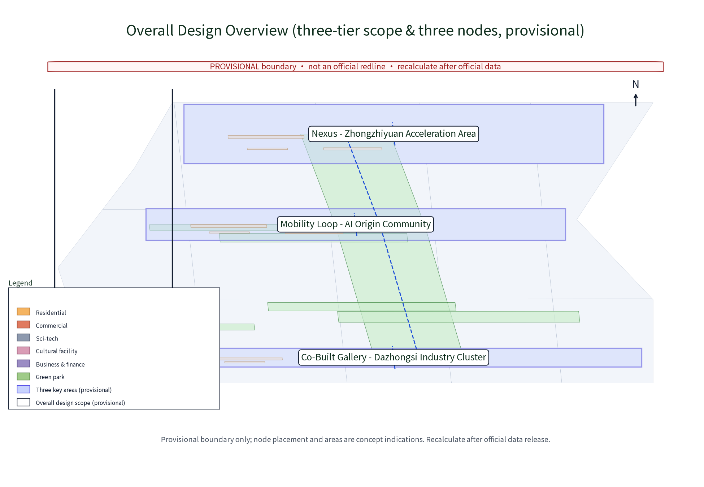
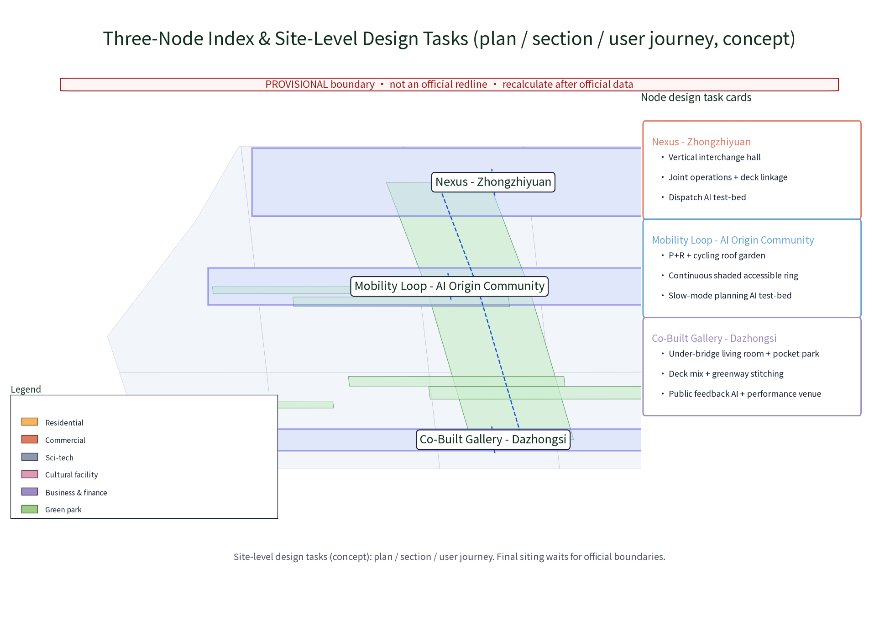
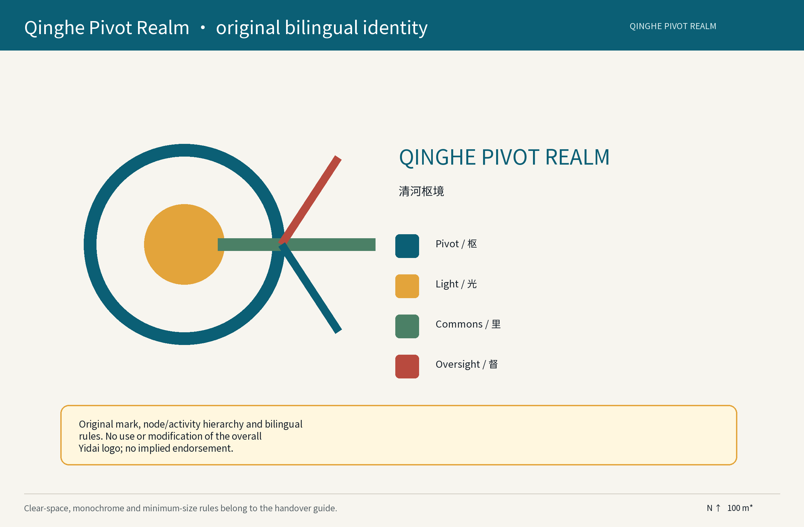
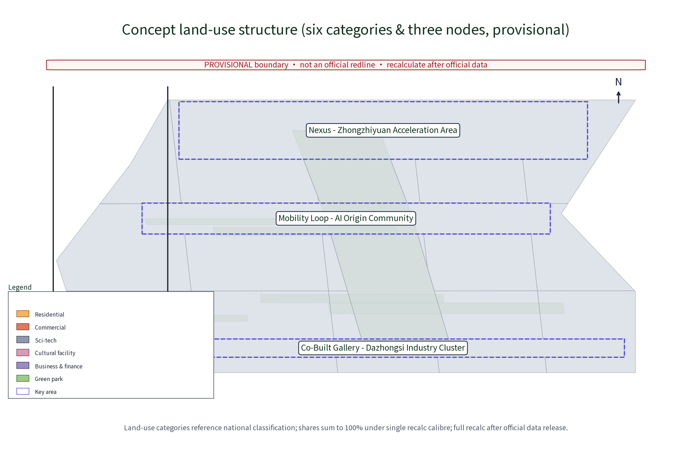
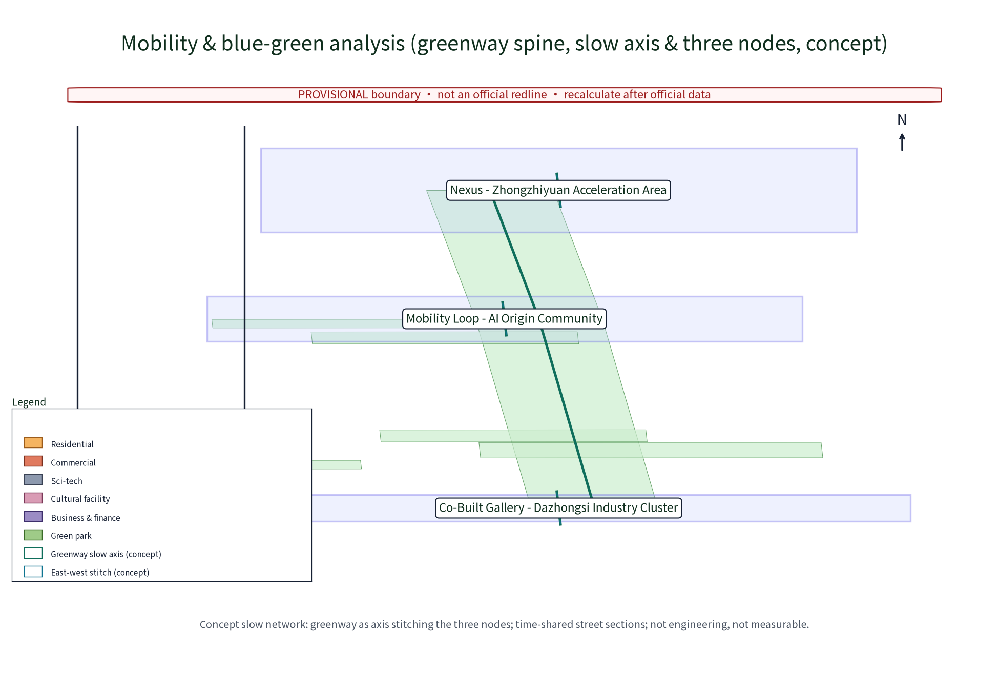
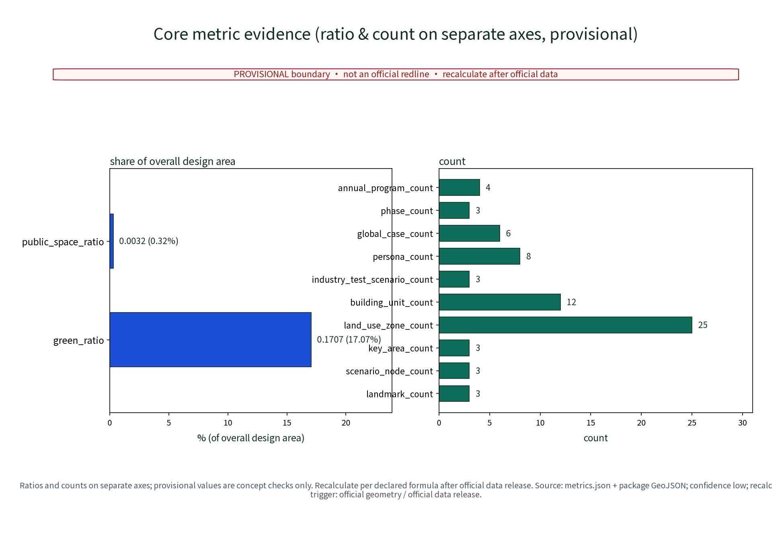

**Name and concept**

“Qinghe Pivot Realm” is an original working name, not a government project name. It keeps One Station–One Pivot and three nodes: Pivot Light Hall (arrival/public service), Rail Pivot Platform (interchange/industry testing), and Pivot Commons (community stitching/everyday operations). They create a decision–demonstration–oversight loop with multi-party review, reversible pilots and resident/operator/professional review. Qinghe, Shangdi and Zhongguancun are pending verifiable interfaces, not asserted land, industry or heritage facts.

## Design basis and evidence register

The concept uses the public brief, public urban-design and land-use references, accessibility material and generative-AI service material. The brief’s 43.6 sq km, 11.4 sq km and approximately 368.4 ha are official text figures only; package polygons and areas are provisional model outputs, not statutory boundaries. The next gate must obtain official boundaries, survey, tenure, rail safety controls, mobility counts, interviews, verified heritage records, budget and operators. Generative-AI material is only a principle for human review, risk and labelling, not a universal legal/compliance claim.

## Three-scope work frame

Macro studies station/corridor interfaces; meso studies arrival, interchange, walking, industry services and community stitching; micro studies reversible pilots. The three zones/two wings are pending interfaces: Zhongzhi Park AI Accelerator, Beijing AI Origin Community, Dazhongsi AI Industry Cluster; Zhongguancun technology-service wing and Xiaoyue River scenario-enablement wing. Boundaries await official verification. The spatial–industry–operation loop is northern demand aggregation → Qinghe–Shangdi–Zhongguancun R&D/translation → three zones/two wings for scenarios, services and talent → east–west stitching and north–south continuity → public review. Jingzhang culture is a pending lead, not confirmed heritage.

### Hierarchy: official three zones/two wings versus three concept nodes

The taskbook objects and the station-level service carriers are deliberately separated. The three zones/two wings are the formal taskbook layer; the three nodes are concept anchors and do not rename, redraw or administratively reassign the formal objects.

|Layer|Object|Role in this package|Boundary/status|
|---|---|---|---|
|Formal three zones|Beijing AI Origin Community; Zhongzhiyuan AI Autonomous Innovation Accelerator; Dazhongsi AI Industry Cluster|Life experience, innovation acceleration and industry-cluster interfaces|Names follow the taskbook; boundaries, tenure and existing industry await official verification|
|Formal two wings|Zhongguancun Technology Service Wing; Xiaoyuehe Scenario Enablement Wing|Technology-service/translation and public-scenario/experience interfaces|No existing organization or data-sharing relationship is assumed|
|Concept three nodes|Pivot Light Hall; Rail Pivot Platform; Pivot Commons|Arrival, interchange/testing and community operations in a One Station–One Pivot loop|Concept anchors only; not zones, new official districts or existing landmarks|

The relationship is “formal zones/wings set interfaces → three nodes carry reversible services → scenario cards return to human review and annual review.”

## Coordination-scope industry and future-city research

This is not an investment promise. The service chain is demand → open application → ethics/privacy/accessibility/safety/maintenance review → small pilot → review → attraction/conversion or exit. Eight resource classes record source, permission, cost, owner and stop condition: land/space, industry, funding, talent, compute, data, scenarios and professional services.

Pending interface matrix (each row is a two-way concept interface, not an existing partnership):

|Interface|Fact to verify|Input/source level|AI/human action|Bilateral value|Owner/gate|Status|
|---|---|---|---|---|---|---|
|Qinghe–Shangdi–Zhongguancun|Commuting, R&D, service and walking links|Demand list, survey, anonymous aggregates; no individual traces|AI organizes needs/routes; regional group confirms|Qinghe gets service/test entry; partner gets auditable demand|Regional working group; verify body, authorization and safety quarterly|Pending|
|Beiwei Community|Community body, service gaps, feeder demand|Resident topics, paper feedback, age-friendly tests|AI clusters topics; council keeps dissent verbatim|Community gets manual-service fixes; proposal gets usage feedback|Community council; human confirmation and complaints gate|Pending|
|Future Science City|Industry, scenario and talent links|Public applications, service directory, event intent|AI proposes matches; interface lead checks facts/permission|Transferable test leads both ways|Industry interface; data boundary first|Pending|
|Huairou Science City|Research translation, test conditions, mobility|Research demand, validation resources, peer review|AI organizes demand; experts decide entry|Research translation leads and city-test questions|Research interface; no presumed data sharing|Pending|
|E-Town|Manufacturing, application and supply chain|Industrial test objects, public leads, maintenance conditions|AI drafts test list; industry lead checks safety/maintenance|Application validation and scenario/talent leads|Industry interface; application-only access|Pending|
|Beijing–Tianjin–Hebei|Cross-area talent, industry and transport|Events, public cases, peer review; no default cross-area data|AI summarizes differences; task group peer-reviews|Comparative learning both ways|Regional task group; annual review|Pending|

### agent.1–6 delivery index

|Agent|Required output|Exact evidence location|
|---|---|---|
|agent.1|Concept/name/logo, three orientations/five functions, hierarchy and structure|Hierarchy table; focus-area response; `assets/figures/logo-update-hub.en.png`, `site-overview.en.png`; Table A1-1|
|agent.2|Cases, ecosystem map, autonomous stack, two-wing interfaces and eight resources|Regional matrix; Table A2-1; `assets/figures/ecosystem-map.en.png`|
|agent.3|≥10 cards, ≥3 protocols, personas and Xiaoyuehe experience|Table A3-1 and A3-2; inclusion matrix; Xiaoyuehe differentiated architecture|
|agent.4|Public-space stitching, east-west/north-south continuity, Dazhongsi smart-native commerce and landmarks|Focus-area tables; inclusion matrix; `key-areas.en.png`, `mobility-bluegreen.en.png`|
|agent.5|Cultural systems, wayfinding and international narrative|Design-basis cultural rule; rights section; bilingual outputs and copyright ledger|
|agent.6|Annual events, brand IP, developer community, test/exit, international communication and conversion|Table A6-1 and A6-2; `metrics.json` annual_program_count=4|

## Overall urban-design and regulatory-depth study

This is a regulatory-depth method, not statutory planning. Pivot Light Hall requires an arrival interface and checks of tenure, fire, flow, lighting, noise and facilities; its minimum is a modular information desk, shade/waiting and paper service with continuous accessible paths, Braille/audio and staff, radius after walking survey. Rail Pivot Platform requires structure, rail safety, tenure and fire checks before any deck/link study; it needs separated flows and redundant accessible lift/ramp, with distances/capacity from simulation. Pivot Commons requires resident, operating-rights, walking-gap and care-space checks; it needs small co-creation, repair, advice and shared services with walking/care/wet-weather tests. Station operator, transport/rail/city bodies, and community operator/residents respectively own gates and maintenance. Safety/access breaches stop a pilot; unpermitted construction does not proceed; unsustained staff/fair access shrinks and transfers. The three are conceptual anchors, not existing landmarks.

> **Evidence anchor**: [depth:three_node_spatial_program], [source:DATA-SRC-MOHURD-CONTROL-DETAILED-PLANNING], [data:PACKAGE-GEOMETRY]. The figure is provisional concept geometry for reading node relationships, not a statutory plan.

## Focus-area design

Light Hall answers where to go after arrival; Rail Pivot Platform makes interchange, testing and display coexist; Commons shares daily services with the community. A shared ledger records application, space, fields, human owner, threshold, complaint, exit and handover. Wayfinding uses the original Qinghe Pivot Realm mark and does not borrow the overall “Yidai” logo.

> **Node-marker convention**: each of the three key areas has exactly one concept node, three markers in total; only the star glyph is a node marker. Boundaries, grid and labels are not nodes. Siting, service radius and spatial relationships await official data and field verification. Evidence anchors: [metric:landmark_count], [data:PACKAGE-GEOMETRY].

Three orientations–five functions–three zones/two wings response (all are pending interfaces and concept mechanisms):

|Brief orientation/function|Spatial carrier|Mechanism and output|Metric/evidence anchor|
|---|---|---|---|
|Century-old Jing-Zhang culture belt|Retain/renew workshop, clue-display surface and a cultural-lead desk|Accept only archive- or survey-ID leads; expert/authority confirmation precedes display|SC-12; [source:DATA-SRC-CASE-DECIDIM]; no evidence, no map label|
|Urban AI life-experience belt|Paper/staffed desks and reversible scenario nodes across the three pivots|Arrival–interchange–community service; AI proposes explainable options, staff sign off|SC-01–SC-07; subgroup thresholds; [metric:persona_count]|
|AI-integrated innovation belt|Shared test cells at Rail Pivot Platform and a developer community at Pivot Commons|Open application → data/safety/access/maintenance review → pilot → review → conversion or exit|T2; 100% field completeness, ≥90% human agreement; [data:authorization dictionary pending]|
|Arrival and interchange|Layered wayfinding and feeder interface between Light Hall and Rail Platform|Operator maintains staffed desk, paper map and queue guidance; statutory checks remain with authorized staff|T1/T3; P90 wait ≤15 minutes; [source:DATA-SRC-OFFICIAL-ANNOUNCEMENT-20260509]|
|Public service and care|Commons service unit, shaded waiting and care point|Older adults, disabled people, child caregivers and low-digital users retain staffed/paper routes|SC-02–SC-05; paper completion ≥85%; [metric:public_space_ratio]|
|Innovation testing and display|Rail test cells and three-node honor/feedback wall|Authorized-data sandbox, expert review and reversible components; expand only after passing|T2 and annual review; two failed cycles exit; [data:pending]|
|East–west stitching|Zhongguancun tech-service wing–Xiaoyue River scenario wing interface events and walking spine|Quarterly interface meetings connect services, talent, funding and professional support without claiming an existing link|Regional matrix; [source:DATA-SRC-AGENT-TASKBOOK-20260518]|
|North–south continuity|Qinghe Station gateway–three pivots–north-station community walking/feeder candidates|Survey crossings, slope, drainage, fire, rail safety and tenure before fixing route or radius|[data:survey/tenure/flow gap]; concept line is not existing condition|

Differentiated area AI architecture matrix (participant proposal, not an official standard):

|Area|Space and operator type|Input → output|Human review / exit|
|---|---|---|---|
|Zhongzhiyuan|Shared test cell; park operator + developer community|Authorized compute/data dictionary/evaluation set → test script, subgroup-error report, paper brief|Data steward and experts sign off; unauthorized fields, drift or maintenance break stops and purges|
|Dazhongsi|Commercial/business interface and Commons service unit; merchant/building operator|Anonymous interval counts, service requests and event applications → roster/event/wayfinding options|Merchant and resident representatives confirm; repeated complaints or equity failure withdraws|
|Xiaoyue River|Blue-green candidate node; public-space operator + resident council|Paper feedback, observation, weather and access checks → experience route and maintenance list|Staff facilitator keeps dissent verbatim; unresolved safety, drainage or care gap means no opening|

### Logo and wayfinding direction (original working mark; no official endorsement)

|Element|Concept direction|Verification/use constraint|
|---|---|---|
|Core mark|`QPR`/Qinghe Pivot Realm: hub ring, sleeper rhythm and one data node for One Station–One Pivot and three-node stitching|Original package drawing; no imitation or borrowing of the overall “Yidai” logo; trademark/owner pending|
|Construction|Outer ring=station-city public interface; 20 rhythm ticks=rail/time; center-to-diagonal node=demand-to-service interface|Fixed working geometry; not a registered mark claim|
|Palette|Rail brick red `#9C1C1C`, tech blue `#0E7490`, AI pulse teal `#0F6E5B`; dark field with white type|Black/white version supplied; concept colours are not an institutional palette|
|Type and bilingual use|Geometric sans; Qinghe Pivot Realm/RAIL.JZ and 清河枢境/站城融环 on one baseline|Local redistributable Noto Sans SC; no CJK left in English figures; license remains in rights ledger|
|Minimum/avoid|Digital minimum 24 px high; print minimum 8 mm; ring+dot simplified below that|No stretch, gradient, government mark, endorsement implication or unlicensed commercial registration|
|Wayfinding|Station/node signs, paper routes and event cards use dark field, white type and ring motif; each node adds name+functional subtitle|Reversible mock-up and contrast test before physical installation; see `logo-concept.en.png`|

> The mark, node names and event hierarchy are working concepts only; trademark and ownership verification is incomplete.

## AI innovation ecosystem, talent and AI+ scenarios

AI is assistive and reversible; it does not replace statutory security, dispatch, planning approval, heritage designation, welfare or eligibility judgment. Generative AI may draft, summarize or translate only authorized data; a responsible human verifies every release and labels source/generation status. It must not invent site images, heritage, industry or boundaries.

There are 12 cards, synchronized in prose, drawings and metrics: SC-01 visitor route; SC-02 older-adult paper service; SC-03 disabled-access route; SC-04 child-caregiver service window; SC-05 low-digital-literacy desk support; SC-06 commuter feeder advice; SC-07 merchant roster; SC-08 developer test script; SC-09 resident-forum topic grouping; SC-10 scenario intake evaluation; SC-11 operations review; SC-12 cultural-lead verification. Each card specifies user/space, input source, AI output, human boundary, threshold, fallback and exit in the figure and matrix.

Three protocols are explicit: T1 feeder/walking (volunteers and three nodes; time window, access need, anonymous counts and weather; three explainable routes plus paper; reachability ≥95%, group older/disabled/visitor, any group <90% triggers human replanning, safety/access fault exits); T2 scenario intake (developer community/Rail Platform; application, budget, schema, privacy/safety/maintenance; score, protocol and responsibility sheet; fields 100%, human agreement ≥90%, grouped by data/space/maintenance, committee rejection falls back and two failed cycles exit); T3 queue assistance (staff desk/Light Hall; anonymous interval counts and staff labels, no face or identity; queue trend/diversion; P90 wait ≤15 min, group older/disabled/low-digital, any >20 min adds staff, drift or repeated complaints stops).

First-party mechanism references are Helsinki public 3D city model, Singapore GovTech Virtual Singapore, official Decidim, TfL Open Data, NYC Open Data and Amsterdam Smart City. They inform basemaps, public testing, participation, transport data, city data governance and ecosystem collaboration; outcomes are not transferred to Qinghe. The ecosystem map connects the eight resources to application–pilot–review–exit.

## Land, building scale and retain/renew decisions

Geometry areas and ratios are model outputs, not statutory figures. Only after survey confirms safety, tenure, structure, operation and cultural value may an asset be classified retain, repair, adapt or rebuild. Until then, do not assign an age, industrial attribute, railway-cultural attribute or existing-facility status as fact. The retain/renew workshop–unit workshop–oversight kiosk follows survey first, classify second; reversible first, permanent later.

The intent is a survey-first, classify-second, intervene-third renewal sequence. `land_use.geojson` expresses model parcels and categories only; it does not replace tenure, statutory land use, heritage, fire, structural or utility evidence. Until professional checks are complete, drawings show relationships rather than existing-condition claims, and metrics follow the single formula in metrics.json before recomputation when official data arrives. Evidence anchors: [source:DATA-SRC-MNR-LAND-USE-CLASSIFICATION-202311], [data:PACKAGE-GEOMETRY], [metric:land_use_zone_count].

## Mobility, rail, municipal and public services

Survey crossings, slope, drainage, lighting, wayfinding, accessibility and night safety before fixing routes. Rail safety is approved by responsible authorities; no unmeasured interchange distance is stated. Paper maps, staffed desks, telephone/on-site booking and printable routes remain. AI interfaces expose transfer-to-staff, stop-collection and source-view controls.

The mobility concept is a testable interface between arrival, interchange and community service, not a claim that the concept line is already connected. Survey flow, crossings, slope, drainage, lighting, rail safety and accessible continuity before fixing routes, capacity, radius or maintenance. AI proposes explainable candidates; authorized staff retain safety and statutory judgment. Evidence anchors: [source:DATA-SRC-MOHURD-URBAN-DESIGN-MEASURES], [source:DATA-SRC-BARRIER-FREE-ENVIRONMENT-LAW], [metric:road_network_length_m].

## Blue-green, public space and urban character

The Jingzhang lead, Xiaoyue River blue-green candidate and station public-service sequence are treated as a continuous experience framework without upgrading any line, green area or historical attribute to verified fact. Reversible, low-glare, low-maintenance components remain subject to drainage, fire, access, night-safety, noise and maintenance checks. Model green_ratio and public_space_ratio are provisional recomputations, not statutory ratios or construction commitments. Evidence anchors: [source:DATA-SRC-MOHURD-URBAN-DESIGN-MEASURES], [source:DATA-SRC-PROVISIONAL-BOUNDARIES-20260605], [metric:green_ratio], [metric:public_space_ratio].

Green, public-space and blue-green links are conceptual geometry and do not confirm water, heritage or existing green space. Use low-glare materials, shade, quiet night lighting, reversible nodes and layered display. Any railway-industrial-heritage wording needs an archive or survey ID; otherwise it is a pending cultural lead.

## Project list, policy and phasing

Each phase binds an entry condition, minimum viable output, stage metric, maintenance owner, failure exit and handover pack. Phase 1 cannot enter construction without formal data; Phase 2 limits work to reversible paper, wayfinding, staffed service and authorized-data pilots; Phase 3 expands only after subgroup thresholds, accessibility acceptance, complaints, human review and maintenance-cost review. Suggested roles remain suggestions, not promised partnerships. Evidence anchors: [depth:phasing_implementation], [source:DATA-SRC-AGENT-TASKBOOK-20260518], [metric:phase_count], [metric:annual_program_count].

Three phases are decision frames, not government commitments: Phase 1 boundary/survey/tenure/interviews; Phase 2 paper service, wayfinding, access repair and three reversible protocols; Phase 3 only passing pilots expand and transfer. The developer community accepts applications monthly, evaluates quarterly and reviews annually. Funding, talent and professional services are pending interfaces. Failed pilots stop collection, remove interfaces, clean data, restore space, publish reasons and hand over responsibility.

## Metrics, recomputation and compliance matrix

Model metrics: site_area_sqm=11,412,825.386 m² (display ~11.413 million m²; low confidence; provisional_site_boundary / EPSG:4548; not an official redline). Green area is 1,948,579.762 m² and green_ratio=0.170736 (display 17.07%, low); public space is 36,150 m² and public_space_ratio=0.003167 (display 0.32%, low). land_use.geojson has 25 features; project each feature to EPSG:4548 and union by land_use_code. The denominator is the union of all categories, 11,412,461.481 m²; areas display to 1 m² and shares to 0.01%, with a ≤1 m² rounding tolerance. This denominator is not a substitute redline; recompute all after official boundary/tenure data. Process counts are 3 nodes, 12 cards, 3 protocols, 8 user journeys, 6 first-party cases and 4 annual programs. Counts do not replace group thresholds, accessibility acceptance, human review, complaints and exit records. The matrix maps requirements to sections, GeoJSON, drawings, metrics, sources, assumptions and four checks.

## Risks, rights and compliance

Rights and compliance follow traceable sources, non-assumed permission and explicit risk boundaries: font, public/institutional text, provisional geometry, case names, marks, figures and assembly dependencies are itemized in `report/copyright_statement.md`. Attribution does not itself grant permission; any external image, basemap, dataset, code or mark without author, source, license, allowed-use and redistribution evidence is excluded from public production, commercial communication and physical installation. AI-generated material is labeled with source and generation status, and high-risk judgments remain with authorized professionals or authorities. Evidence anchors: [source:DATA-SRC-GENERATIVE-AI-INTERIM-MEASURES], [source:DATA-SRC-BARRIER-FREE-ENVIRONMENT-LAW], [source:DATA-SRC-AGENT-TASKBOOK-20260518].

Provisional geometry, missing data and human final judgment remain explicit. Risks include rail/structural safety, tenure/statutory controls, data minimization, accessibility equity, operating funds and public acceptance. Statutory security, dispatch, planning approval, heritage and welfare decisions remain human/authority decisions. The original Qinghe Pivot Realm mark and node/activity hierarchy do not imply endorsement or reuse the overall “Yidai” logo. Offline pages embed redistributable local Noto Sans SC and use no external assets.

## References

- [source:DATA-SRC-OFFICIAL-ANNOUNCEMENT-20260509] Public call announcement.
- [source:DATA-SRC-AGENT-TASKBOOK-20260518] Brief and delivery requirements.
- [source:DATA-SRC-MOHURD-URBAN-DESIGN-MEASURES] Public urban-design reference.
- [source:DATA-SRC-MOHURD-CONTROL-DETAILED-PLANNING] Public regulatory-depth reference.
- [source:DATA-SRC-MNR-LAND-USE-CLASSIFICATION-202311] Public land-use classification guide.
- [source:DATA-SRC-GENERATIVE-AI-INTERIM-MEASURES] Narrow risk/human-review reference only.
- [source:DATA-SRC-BARRIER-FREE-ENVIRONMENT-LAW] Public accessibility reference.
- [source:DATA-SRC-CASE-HELSINKI-3D] Helsinki public 3D city model.
- [source:DATA-SRC-CASE-SINGAPORE-VIRTUAL] Singapore GovTech Virtual Singapore.
- [source:DATA-SRC-CASE-DECIDIM] Official Decidim project.
- [source:DATA-SRC-CASE-TFL-OPEN-DATA] Official TfL open data.
- [source:DATA-SRC-CASE-NYC-OPEN-DATA] Official NYC open data.
- [source:DATA-SRC-CASE-AMSTERDAM-SMART-CITY] Official Amsterdam Smart City network.

