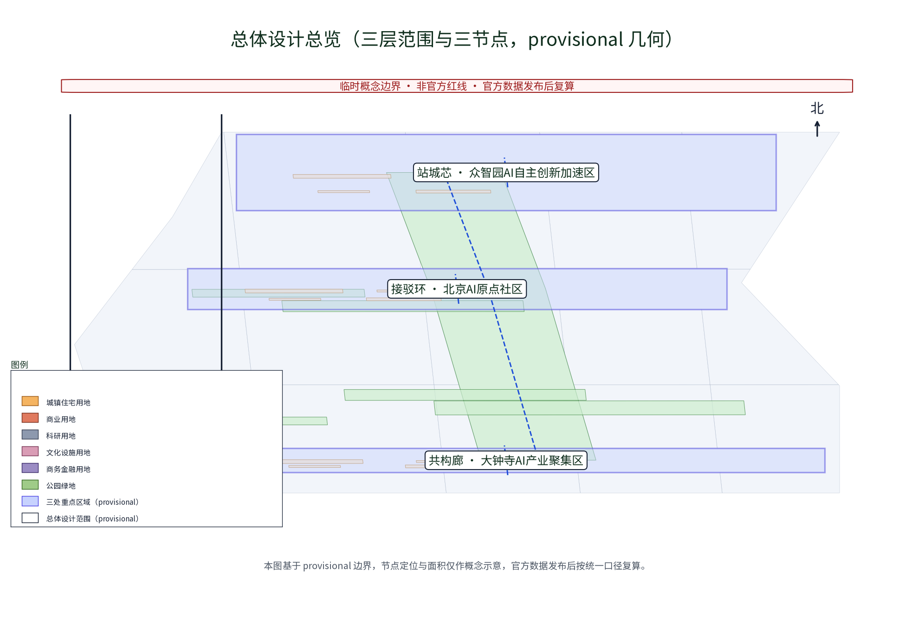
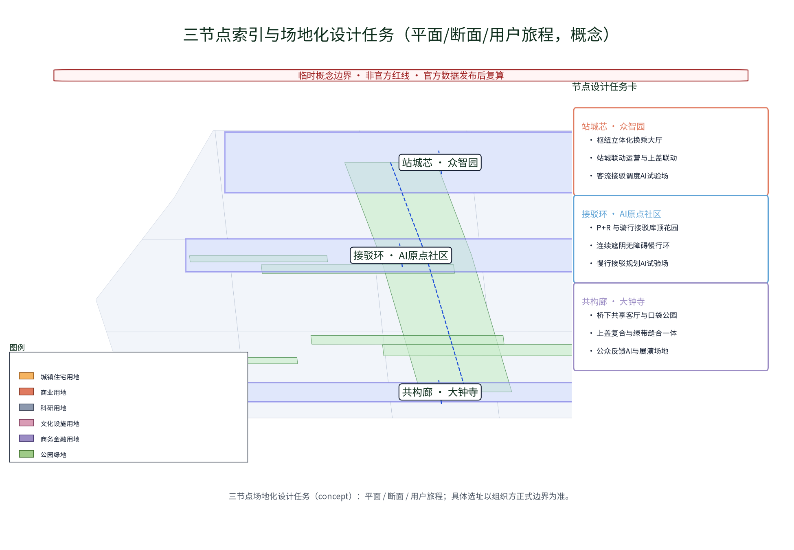
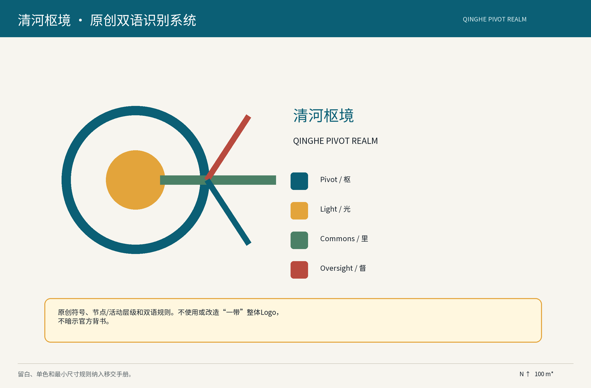
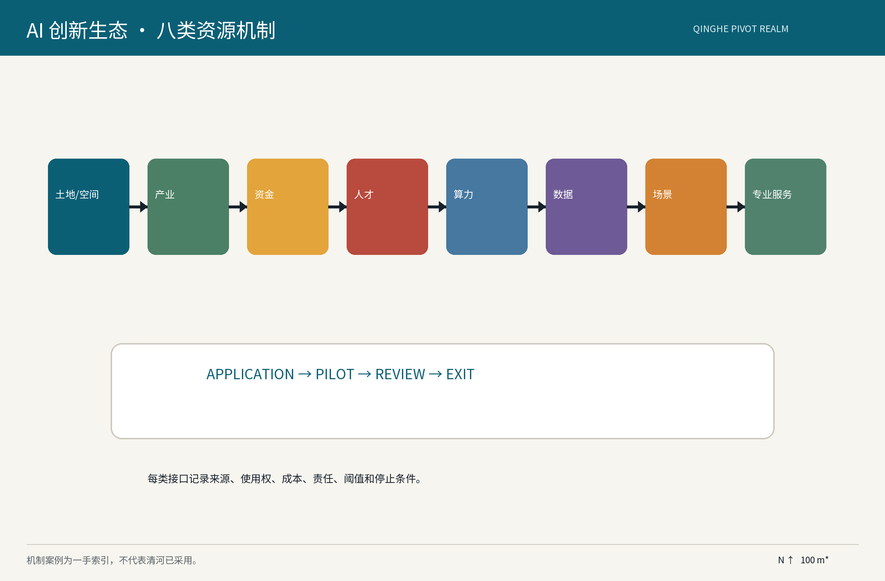
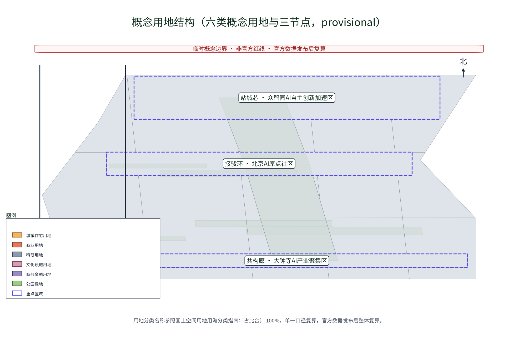
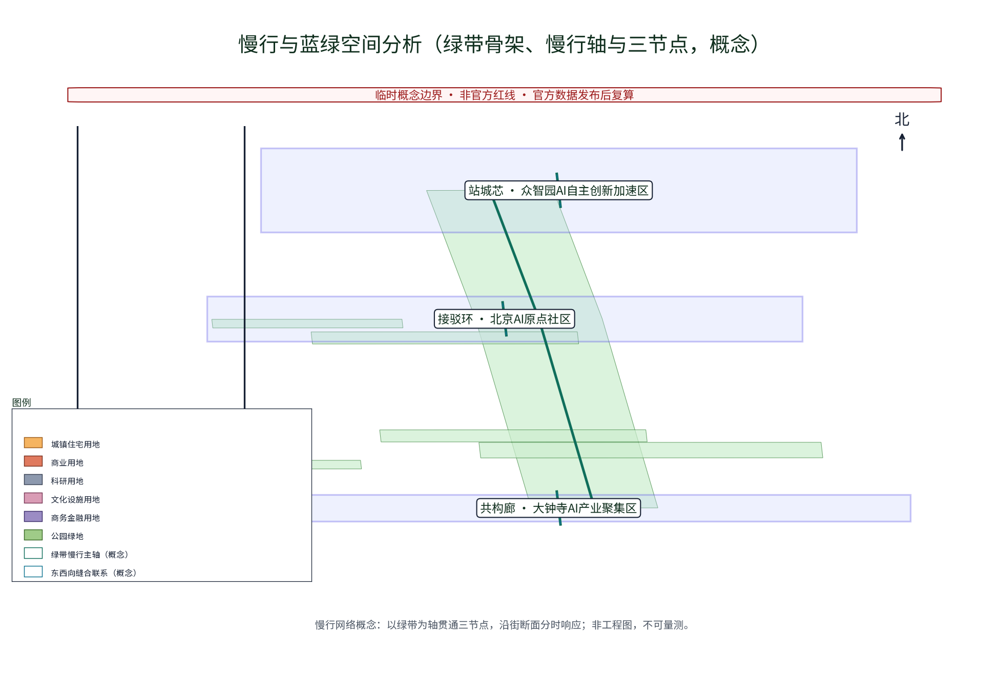
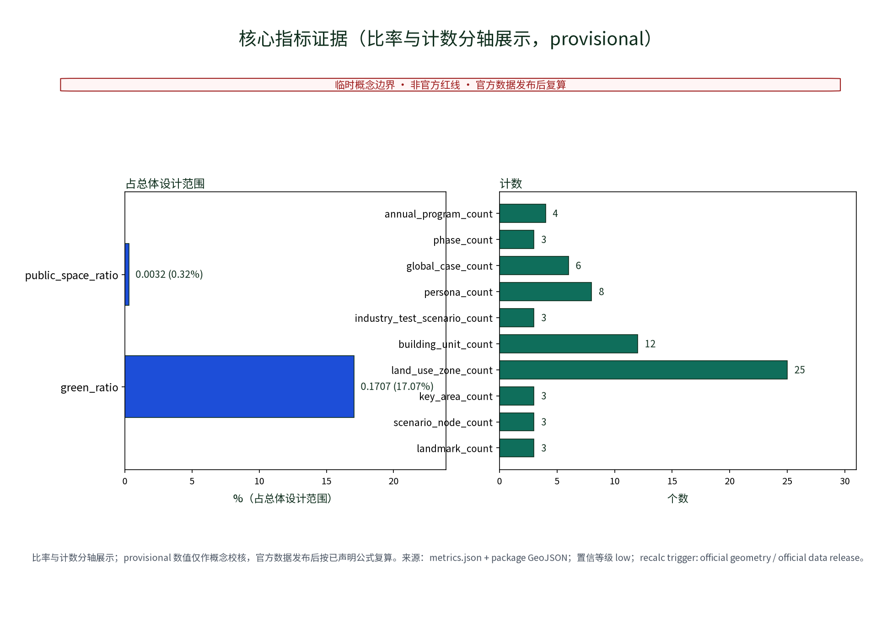

**方案名称与总体构想（概念）**

「清河枢境 / Qinghe Pivot Realm」是原创工作名称，不代表政府项目名称。保留“一站一枢、三节点织网”：枢光客厅（到达与公共服务）、轨上枢台（换乘与产业试验）、枢合里（社区缝合与日常运营）。三节点形成决策—示范—监督闭环：多主体审议、可逆小试、居民/运营者/专业团队共同复盘。清河、上地、中关村仅作为待核验接口，不把未核验的土地、产业或遗存写成现状。

## 设计依据与资料清单

依据公开任务书、城市设计与用地分类公开材料、无障碍和生成式AI服务相关公开材料编制。任务书中的43.6平方公里、11.4平方公里、约368.4公顷仅为官方文本口径；本包 polygon 和面积是 provisional 设计模型，不是法定边界。下一闸门需补齐官方边界/坐标、现状测绘、产权权属、轨道安全控制、交通客流、居民商户访谈、经核验文化名录、预算和运营主体。生成式AI材料仅用于人工复核、风险评估和内容标识原则，不是已合规或适用于所有AI的法律结论。

设计意图是把“公开任务—空间试点—人工复核—复算移交”做成可追踪链路：公告和任务书只支撑范围、任务与文本口径，城市设计与用地指南支撑方法和分类词，不支撑项目审批；几何层只承担概念表达与机器校验。每一条待确认资料都进入闸门清单，未取得官方边界、权属、轨道安全、客流和运营主体前，不把模型面积、路线或节点写成现状。证据锚点：[source:DATA-SRC-OFFICIAL-ANNOUNCEMENT-20260509]、[source:DATA-SRC-AGENT-TASKBOOK-20260518]、[source:DATA-SRC-PROVISIONAL-BOUNDARIES-20260605]。

## 三层范围工作框架

宏观层研究枢纽和创新带接口，中观层研究站前公共空间/换乘/慢行/产业服务/社区缝合，微观层研究三个可逆试点。三区两翼采用待确认表达：三区为众智园AI自主创新加速区、北京AI原点社区、大钟寺AI产业集聚区；两翼为中关村科技服务翼、小月河场景赋能翼。名称遵循任务书，边界和空间关系待官方资料核验。空间—产业—运营闭环为：北部门户汇聚需求→清河—上地—中关村承接研发/转化→三区两翼承接场景/服务/人才→东西缝合、南北贯通后公开复盘。京张文化仅为待核验线索，不预设遗存。

三层的设计输出分别是接口假设、空间/运营导则和可逆试点卡；上层约束下层，但不把下层概念节点反推为官方边界。`geometry/site_boundary.geojson`、`key_areas.geojson` 仅用于展示，指标中的面积与比例必须沿统一公式复算，正式数据到位后覆盖旧版本并保留差异记录。三层之间用“需求清单—场景申请—空间核验—试点记录—年度复盘”传导，任何一环缺资料就停在建议状态。证据锚点：[source:DATA-SRC-AGENT-TASKBOOK-20260518]、[source:DATA-SRC-PROVISIONAL-BOUNDARIES-20260605]、[data:PACKAGE-GEOMETRY]。

### 任务书三区两翼与本方案三节点的层级关系

下表把任务书的正式对象与本方案的概念载体分开：三区两翼是任务书层级，三节点是站区内的概念服务编排，不是对三区名称、边界或行政归属的改写。

|层级|正式/概念对象|本包中的职责|边界与证据状态|
|---|---|---|---|
|任务书正式三区|北京AI原点社区；众智园AI自主创新加速区；大钟寺AI产业集聚区|承接生活体验、创新加速、产业集聚的任务接口|名称按任务书；边界、权属、产业现状均待官方资料核验|
|任务书正式两翼|中关村科技服务翼；小月河场景赋能翼|分别承接技术服务/转化与公共场景/体验接口|不宣称既有组织或数据共享关系；按接口申请和季度复核进入|
|本方案三节点|枢光客厅；轨上枢台；枢合里|把到达、换乘/试验、社区运营编成一站一枢闭环|站区内概念锚点；不等同三区、不新增官方片区、不宣称既成地标|

层级关系为“三区两翼定任务接口—三节点承载可逆服务—场景卡回到人工复核与年度复盘”。

## 统筹研究范围产业与未来城市研究

本节把八类资源从愿景转成可审的接口：每个接口至少记录对象、来源、使用权、进入条件、人工责任、输出和停止条件，避免把产业协作写成已发生事实。区域协同只作为待确认的测试和人才交流回路，必须先完成主体核验、数据授权和安全评估；其输出回到场景卡、试点清单和年度复盘，不直接改变法定规划。证据锚点：[source:DATA-SRC-AGENT-TASKBOOK-20260518]、[depth:regional_interface_matrix]。

产业策略不是招商承诺，而是“需求→开放申请→伦理/隐私/无障碍/安全/维护评估→小试→复盘→招引转化或退出”。土地/空间、产业、资金、人才、算力、数据、场景、专业服务八类资源均记录来源、使用权、成本、责任和停止条件。

区域协同接口矩阵（待确认；每一行均为可核验的双向接口，不是已发生合作）：

|接口|待核验事实|输入/来源级别|AI/人工动作|双向价值|责任/闸门|状态|
|---|---|---|---|---|---|---|
|清河—上地—中关村|通勤、研发、企业服务、慢行联系|需求清单、现场测绘、匿名聚合；不含个体轨迹|AI整理需求/路线草案；区域工作组人工确认|清河获得服务与测试入口；接口方获得可复核场景需求|区域工作组；季度核对主体、授权和安全|待核验|
|北纬社区|社区主体、服务缺口、接驳需求|居民议题、纸本反馈、适老测试记录|AI只做议题归类；议事会保留异议原文|社区获得人工服务整改；方案获得真实使用反馈|社区议事会；人工确认、投诉闸门|待核验|
|未来科学城|产业链、场景、人才接口|公开申请、专业服务目录、人才活动意向|AI生成候选匹配；接口人审查事实和权限|清河获得可迁移测试；对方获得应用场景入口|产业接口人；先签数据边界|待核验|
|怀柔科学城|科研转化、试验条件、交通联系|科研需求、验证资源、专家评议|AI整理需求；专家评议决定是否进入测试|清河获得科研转化线索；对方获得城市试验问题|科研接口人；不默认共享数据|待核验|
|经开区|制造、应用示范、供应链关系|工业测试对象、公开招引线索、维护条件|AI形成测试清单；产业接口人审查安全/维护|清河获得应用验证；对方获得场景和人才线索|产业接口人；申请制接入|待核验|
|京津冀|跨区人才、产业、交通协同|活动、公开案例、同行评审；不默认跨区数据|AI整理经验差异；协同专班人工互审|清河获得比较视角；外部伙伴获得可解释概念样本|协同专班；年度评估|待核验|

### agent.1—6 可定位交付索引

|智能体|必交输出|本包精确证据位置|
|---|---|---|
|agent.1|概念、名称、Logo方向、三定位/五功能、三区两翼与结构|本节层级表；重点区域第1—2表；`assets/figures/logo-update-hub.png`、`assets/figures/site-overview.png`；`Table A1-1`（下表）|
|agent.2|全球案例、生态图、八类资源、自主创新栈与两翼接口|本节区域矩阵；AI节案例/八要素表；`assets/figures/ecosystem-map.png`；`Table A2-1`|
|agent.3|≥10场景卡、≥3测试协议、用户画像与小月河体验|AI节`Table A3-1`十二卡、`Table A3-2`三协议；包容性矩阵；小月河差异化架构|
|agent.4|公共空间缝合、东西/南北连续、大钟寺智能原生商务、地标与组件|重点区域表；蓝绿/公共空间包容性矩阵；`assets/figures/key-areas.png`、`assets/figures/mobility-bluegreen.png`|
|agent.5|文化系统、导视、国际化叙事与版权边界|设计依据文化线索规则；风险/版权节；中英双语图与`report/copyright_statement.md`|
|agent.6|年度活动、品牌IP、开发者社区、试点/退出、国际传播与转化|实施节`Table A6-1`实施台账、`Table A6-2`年度运营；`metrics.json` annual_program_count=4|

索引中的“位置”指正文表名、章节和具体文件名；所有输出仍受 provisional、人工复核和待授权边界约束。

## 总体设计范围城市更新与控规深度城市设计

本节是控规深度研究方法，不替代法定规划。三节点选址与实施约束：

|节点|选址与现状核查|空间/通达目标|主体、闸门、维护和停损|
|---|---|---|---|
|枢光客厅|公共到达界面；核查权属、消防、客流、照明、噪声、既有设施|模块化信息台、等候遮荫、纸本点；连续无障碍、盲文/语音、人工服务；半径由步行测绘确定|站区运营者；先客流/无障碍审计再两周示范；运营者维护，连续三次安全/投诉超阈值即停|
|轨上枢台|仅在结构、轨道安全、权属、消防核验后研究上盖/连廊|换乘分流、可视导视、无障碍电梯/坡道冗余；距离容量由仿真确定|交通/铁路/城建主体审议；先安全闸门再低风险试验；无许可不建设|
|枢合里|站北社区连接；核查居民意愿、经营权、慢行断点、照护空间|共创、维修、咨询、共享服务；步行/照护/雨天可用性现场验收|社区运营方与居民监督；月度清单；不能维持人工或公平使用则缩小并移交|

三个节点是概念锚点，不是既成地标；以功能模块代替虚构建筑面积。调查须出照片、测绘、权属、分时客流、无障碍障碍点、噪声/照明和文化线索，数据到位后复算。

> **证据锚点**：[depth:three_node_spatial_program]、[source:DATA-SRC-MOHURD-CONTROL-DETAILED-PLANNING]、[data:PACKAGE-GEOMETRY]。图面为 provisional 概念几何，服务于节点关系和接口阅读，不替代法定控规。

## 重点区域详细设计

枢光客厅解决到达导引，轨上枢台解决换乘/试验/展示共存，枢合里解决站区与社区共享日常服务。共享台账记录申请、空间、数据字段、人工责任、阈值、投诉、退出和移交规格。导视使用清河枢境原创符号，不借用“一带”整体Logo。

三大定位—五大功能—三区两翼—本方案响应（均为待核验接口与概念机制）：

|任务书定位/功能|空间载体|机制与输出|指标/证据锚点|
|---|---|---|---|
|百年京张文化带|留改坊、留线索展示面、枢光客厅文化线索台|仅接收有档案或调查编号的线索；专家/主管部门确认后再决定展示|SC-12；[source:DATA-SRC-CASE-DECIDIM]；无证据不上图|
|都市AI生活体验带|三节点纸本/人工服务台与可逆场景节点|到达—换乘—社区连续服务，AI只给可解释候选，人工签发|SC-01—SC-07；人工复核与分群阈值；[metric:persona_count]|
|AI融合创新带|轨上枢台共享测试单元、枢合里开发者社区|开放申请→数据/安全/无障碍/维护评估→小试→复盘→转化或退出|T2；字段完整率100%、人工一致率≥90%；[data:待确认授权字典]|
|到达与换乘组织|枢光客厅—轨上枢台之间的分层导视与接驳界面|站区运营者维护人工柜台、纸本地图和排队引导，法定安检仍由权责人员执行|T1/T3；P90等候≤15分钟；[source:DATA-SRC-OFFICIAL-ANNOUNCEMENT-20260509]|
|公共服务与社区照护|枢合里共享服务单元、遮荫等候与照护点|面向老年人、残障人士、儿童照护者、低数字能力用户保留人工/纸本路径|SC-02—SC-05；纸本完成率≥85%；[metric:public_space_ratio]|
|创新测试与成果展示|轨上枢台测试单元、三节点荣誉/反馈墙|授权数据沙盒、专家评议、可逆组件，达标后才扩大|T2、年度复盘；连续两期失败退出；[data:待确认]|
|东西缝合|中关村科技服务翼—小月河场景赋能翼的接口活动与慢行骨架|以季度接口会议和场景申请连接服务、人才、资金、专业服务，不宣称已建成联系|区域接口矩阵；[source:DATA-SRC-AGENT-TASKBOOK-20260518]|
|南北贯通|清河站门户—三节点—站北社区的连续步行/接驳候选线|先核查过街、坡度、排水、消防、轨道安全与产权，后确定路线和半径|[data:现状测绘/权属/客流缺口]；不把概念线当现状|

片区差异化 AI 架构矩阵（participant proposal，不是官方标准）：

|片区|空间与运营主体类型|输入→输出|人工复核/退出|
|---|---|---|---|
|众智园|共享测试单元；园区运营者+开发者社区|授权算力/数据字典/评测集→测试脚本、误差分群报告、纸本摘要|数据管理员与专家签发；越权字段、漂移或维护中断即停用并清理|
|大钟寺|商业/商务接口与枢合里服务单元；商户/楼宇运营者|匿名时段客流、服务需求、活动申请→排班/活动/导视候选|商户与社区代表确认；投诉连续超阈值或公平性不达标则撤回|
|小月河|蓝绿空间候选节点；公共空间运营者+居民议事会|纸本意见、观察记录、天气和无障碍核查→体验路径与维护清单|人工主持保留异议原文；安全、排水或照护缺口未闭环则不开放|

> **节点图例口径**：三个重点区各对应一个概念节点，共 3 个；图中星标才是节点标记，边界、网格和文字不是节点。位置、服务半径与空间关系都待官方资料和现场核验。证据锚点：[metric:landmark_count]、[data:PACKAGE-GEOMETRY]。

### Logo与导视方向（原创工作标识，非官方背书）

|要素|概念方向|核验/使用约束|
|---|---|---|
|核心符号|`QPR`/“清河枢境”：环形枢纽、轨枕节律、一个数据节点，表达“一站一枢、三节点织网”|由本包原创绘制；不模拟、不借用“一带”整体Logo，商标检索与权利人待确认|
|构造|外环=站城公共界面；20个节律刻点=轨道/时间；中心点—斜向节点=需求到服务接口|比例、留白和节点关系固定为工作制图规则；不宣称注册标志|
|颜色|铁路砖红 `#9C1C1C`、科技蓝 `#0E7490`、AI脉冲青绿 `#0F6E5B`，深色底配白字|同时提供全黑/全白单色版；颜色只作概念识别，不等同机构色彩|
|字体与中英|无衬线几何字型；中文“清河枢境/站城融环”与英文“Qinghe Pivot Realm/RAIL.JZ”按同一基线排布|使用包内可再分发 Noto Sans SC；英文图不残留中文；正式字体授权仍按版权表核验|
|最小尺寸与禁用|数字/屏幕建议最小高度24 px，印刷建议最小高度8 mm；低于此尺寸只用环+点简版|不得拉伸、加渐变、叠加政府标志、暗示官方认证或用于未经许可的商业注册|
|导视应用|站牌、节点牌、纸本路线、活动卡使用深色底/白字/环形辅助图形；三节点以节点名+功能副标题区分|先做可逆样牌与无障碍对比度测试，再决定实体安装；`logo-concept.png`为概念图|

> Logo、节点名和活动层级均为工作概念；不把图形、名称或色彩写成官方品牌，不声称已完成商标或权属核验。

## AI 创新生态、人才画像与 AI+ 场景

AI章节的设计意图是让每张卡都能从空间节点回到运营责任和人工兜底：输入只取授权且最小化的数据，输出必须标注草案状态，涉及交通、安检、文化认定、福利或规划判断时由有权责人员签发。卡片数量、三项测试协议、分群阈值和退出动作分别落在正文、metrics.json、矩阵与图件中；没有真实样本、现场基线和授权字典时，所有效果都保持概念/待验证。证据锚点：[source:DATA-SRC-GENERATIVE-AI-INTERIM-MEASURES]、[source:DATA-SRC-AGENT-TASKBOOK-20260518]、[metric:scenario_card_count]。

AI仅作可回退辅助，不替代法定安检、交通调度、规划审批、遗产认定、福利资格或人工裁量。生成式AI仅在授权数据内做草案/摘要/翻译，发布前人工逐项核验并标注来源和生成状态，不补造现场照片、遗产、产业或边界。

12张结构化场景卡（正文、图件、metrics均为12；每行均明确问题、输入来源级别、AI角色、人工边界、最小化、运营者、指标、回退与退出）：

|ID|用户/节点|问题|输入与来源级别|AI角色|人工边界/最小化/运营者|成功指标；回退/退出|
|---|---|---|---|---|---|---|
|SC-01|临时访客/枢光客厅|首次到达找不到换乘与公共服务|服务状态、现场人工录入；授权运营数据|生成多语路线草案|工作人员签发；只存区间/服务类型，不存轨迹；站区运营者|找路≥90%；无数据转纸本人工，安全信息异常停用|
|SC-02|老年人/枢光客厅|数字渠道不适配且不愿被画像|纸本问卷、观察记录；人工采集|归纳时段服务建议|柜台人员判断；拒答不存、只保留汇总；社区服务员|纸本完成≥85%；拒答即删除，连续投诉则停用该问卷|
|SC-03|残障人士/三节点|路线连续性、坡度和障碍点不明|无障碍清单、现场测绘；专业核验|提出路线候选和障碍清单|专业人员现场验收；只记录障碍类型；无障碍协调员|连续通行≥95%；不达标回到人工重规划，安全缺口退出|
|SC-04|儿童照护者/枢合里|照护服务等待与容量不透明|预约、容量、人工服务记录；授权台账|生成服务时段提示|工作人员值守；不采集儿童身份；社区运营者|P90等候≤15分钟；超阈值限流并增派人工，连续两期不达标退出|
|SC-05|低数字能力/枢光客厅|线上申请无法完成|柜台记录、纸本；人工服务|归类需求并生成回访清单|人工回访签发；只留服务类别；公共服务台|线下闭环≥90%；AI不可用即全量人工，数据字段越权即清理|
|SC-06|通勤者/接驳环|换乘路径受天气与时段影响|匿名分时计数、天气；公开/授权汇总|给出可解释接驳候选|工作人员审查，不输出个体轨迹；交通服务员|可行率≥95%；传感器异常转纸本，漂移或安全投诉停用|
|SC-07|商户/大钟寺节点|活动/排班与客流错配|匿名时段客流、服务需求、活动申请；授权汇总|生成排班、活动与导视候选|商户/社区代表确认；不识别顾客；楼宇运营者|满意≥4/5；公平性或投诉不达标撤销并人工复盘|
|SC-08|开发者/轨上枢台|试点申请缺少数据与维护条件|申请表、授权字典、评测集；申请人提供|生成测试脚本与字段清单|专家审查；只接入授权字段；开发者社区管理员|字段完整100%；缺项退回，越权或维护中断清理退出|
|SC-09|居民议事/枢合里|口述意见难以形成可审议议题|议题、纸本/口述；居民自愿提交|生成主题聚类草案|人工主持决定；保留异议原文、可匿名；居民议事会|覆盖≥90%；争议不强行归类，连续两期无人工主持则停用|
|SC-10|场景评估/三节点|候选场景的安全/维护条件不可比|预算、安全、无障碍、维护表；申请资料|生成评分草案、责任表|委员会作决定；不补造缺失事实；场景评审组|四项齐全才试点；缺项不试点，连续两期失败退出|
|SC-11|运营复盘/全域|指标、投诉和退出原因分散|匿名指标、投诉、维护记录；运营台账|生成月报与异常提示|经理逐项重算/签发；只用汇总；运营复盘组|按期100%；异常人工重算，重复异常触发暂停与移交|
|SC-12|文化线索/接口空间|文化线索易被误写为既成事实|档案目录、调查编号；公开/待核验资料|生成待核验清单|专家/主管主体确认；只保存出处和状态；文化线索台|每条有出处/状态；无证据不上图，无法核验即归档不展示|

### Table A3-2 · 产业测试协议

|协议|对象/节点与采样|输入/输出|人工与隐私边界|成功阈值|回退/退出|
|---|---|---|---|---|---|
|T1 接驳与步行|志愿者；三节点；时间窗分层|无障碍需求、匿名计数、天气→三条可解释路线+纸本|人工领队验收；不采轨迹|可达率≥95%；老年/残障/访客任一≥90%|任一分群<90%人工重规划；安全/无障碍异常退出|
|T2 场景开放评估|开发者；轨上枢台；申请批次|申请、预算、数据字典、隐私/安全/维护表→评分、协议、责任表|专家/委员会决定；仅授权字段|字段完整100%；人工一致≥90%|缺项退回；委员会否决回退；连续两期失败退出|
|T3 排队辅助|枢光客厅人工台；分时段对照|匿名人数、服务类型、人工标注→趋势与分流建议|不做人脸/个体识别；工作人员签发|P90≤15分钟；按老年/残障/低数字能力分群|任一>20分钟增派人工；漂移或投诉连续超阈值停用|

### Table A2-1 · 全球机制案例与八类资源

下表只抽取公开机制，不把外地成效、合作关系或许可移植成清河事实；八类资源为可审接口字段。

|案例（6个）|土地/空间|产业|资金|人才|算力|数据|场景|
|---|---|---|---|---|---|---|---|
|Helsinki 3D City Model|城市三维底图/公共空间接口|城市规划与服务协同|公共数字基础设施投入机制待核|规划/数据团队|模型与可视化算力|公开模型/元数据条款待核|规划沟通与空间测试|
|Singapore Virtual Singapore|国家/城市模型平台|GovTech与跨部门应用|公共研发机制待核|政府/科研/开发者|三维仿真算力|模型数据权限分级待核|情景模拟与公共决策支持|
|Decidim|参与式平台与公共议事空间|公民科技生态|开源/公共维护机制|社区主持人与开发者|平台运行资源|参与数据治理规则待核|议题提交、讨论与反馈|
|TfL Open Data|交通服务接口|交通服务创新|公共运营与开发者生态|交通分析/应用开发者|实时/历史处理资源|开放交通数据条款待核|路线、可达性与服务应用|
|NYC Open Data|城市部门数据门户|城市数据服务生态|公共数据基础设施|部门数据管理员与开发者|数据平台资源|开放数据条款与字段治理|公共服务查询与监督|
|Amsterdam Smart City|城市创新网络与试验空间|多主体创新协作|项目制/伙伴机制待核|企业、研究者、社区|试验平台资源|项目数据权限待核|能源、移动与公共空间试验|

生态接口统一走“申请—授权/伦理—小试—分群验收—复盘—转化或退出”，不把案例的公开机制写成清河现状。

## 用地、建筑规模与拆改留方案

geometry面积比例是模型值，不是法定指标。经现状调查确认安全、权属、结构、运营和文化价值后，才分类为保留、修缮、改造或重建；未经核验不对建筑年代、工业属性、铁路文化属性或既有公共设施作事实命名。采用留改坊—单元坊—督行亭：先调查后分类、先可逆后永久；留改坊保存线索并小试，单元坊承载可替换服务，督行亭公开指标、投诉和退出。

用地与建筑的设计意图是建立“先核验、后分类、再介入”的可逆更新顺序：`land_use.geojson` 的图斑、分类和面积只说明模型口径，不能替代权属、法定用地、文保、消防、结构或地下管线资料。保留、修缮、改造、重建的建议必须由专业团队逐项核查后决定；在此之前，图件只展示空间关系，不宣称现状属性。指标与图件统一使用 metrics.json 的公式，官方数据发布后整体复算。证据锚点：[source:DATA-SRC-MNR-LAND-USE-CLASSIFICATION-202311]、[data:PACKAGE-GEOMETRY]、[metric:land_use_zone_count]。

## 交通、轨道、市政与公共服务设施

现场核验过街、坡度、排水、照明、导视、无障碍、夜间安全后定路线；轨道安全由权责主体审定，不写未经测绘的换乘距离。保留纸本地图、人工柜台、电话/现场预约和可打印路线；AI界面有转人工、停止采集、查看来源入口。

交通方案的核心不是凭概念线宣称“已连通”，而是把到达、换乘和社区服务拆成可测试接口：先记录分时客流、过街冲突、坡度、排水、照明、轨道安全和无障碍连续性，再确定路径、容量、服务半径与维护责任。未获得现状测绘和权责主体确认前，所有路线、等待时间和接驳建议均为测试假设；AI只生成可解释候选，授权人员和现场工作人员负责安全及法定判断。证据锚点：[source:DATA-SRC-MOHURD-URBAN-DESIGN-MEASURES]、[source:DATA-SRC-BARRIER-FREE-ENVIRONMENT-LAW]、[metric:road_network_length_m]。

## 蓝绿空间、公共空间与城市风貌

图中绿地、公共空间和蓝绿连接是概念几何，不确认水系、遗产或现状绿地。采用低反光、遮荫、安静夜景、可逆节点和分层展示。文化表述必须有档案或调查编号，否则只显示“待核验文化线索”。

设计上以京张遗址线索、小月河蓝绿候选和站区公共服务作为连续体验框架，但不把任何一段线、绿地或历史属性升级为已核验事实。公共空间组件优先采用可移动、可拆卸、低照度与低维护方案；每项介入都要经过排水、消防、无障碍、夜间安全、噪声和维护核查。模型中的 green_ratio 与 public_space_ratio 只反映 provisional 几何的复算结果，不能直接作为法定指标或建设承诺。证据锚点：[source:DATA-SRC-MOHURD-URBAN-DESIGN-MEASURES]、[source:DATA-SRC-PROVISIONAL-BOUNDARIES-20260605]、[metric:green_ratio]。

### 包容性矩阵（八类用户，人工等价路径是硬约束）

|用户群|关键旅程|人工/线下等价路径|无障碍信息与验收|紧急回退与指标|
|---|---|---|---|---|
|居民|议题提出—反馈—复盘|纸本意见箱、居民议事会、电话/现场回访|提供大字、语音、可读路线；异议原文保留|AI不可用仍可提交；覆盖≥90%|
|青年人才/开发者|申请场景—测试—发布|人工申请窗口、纸本协议、专家答疑|说明字段、时间、空间、维护条件；人工签发|缺项退回，不因数字失败丧失申请权|
|站区工作人员/通勤者|到达—换乘—离站|人工柜台、纸本地图、现场引导|连续无障碍路径与换乘信息现场验收|拥堵或系统异常增派人工；P90≤15分钟|
|临时访客|找路—服务—离开|多语纸本路线、服务台、电话|中英/图标/语音提示；不依赖个人设备|无数据直接人工导引；找路≥90%|
|老年人|问询—等候—完成服务|适老柜台、纸本、大字版、陪同|座椅、遮荫、语音/大字；拒答不存|AI关闭仍完整服务；纸本完成≥85%|
|残障人士|识别障碍—选择路线—到达|工作人员陪行、可打印路线、现场复核|坡度、宽度、电梯、盲文/语音和连续性验收|障碍或电梯故障改由人工安排；连续通行≥95%|
|儿童照护者|到达—照护—离场|人工预约、现场候补、照护服务台|推车/座椅/卫生与避雨信息现场确认|容量超阈值限流并增派人员；P90≤15分钟|
|低数字能力用户|申请—查询—投诉|纸本表、人工录入、现场/电话投诉|读写辅助、可追踪纸本回执；不强迫扫码|线上故障全量转人工；线下闭环≥90%|

上述矩阵的人工渠道、可达性和紧急回退须在每轮小试前现场验收；分群阈值是扩展闸门，不是效果承诺。

## 更新项目清单、实施政策与分期计划

三期是决策框架而非政府承诺：阶段1边界/测绘/权属/访谈；阶段2纸本服务、导视、无障碍整改和三协议可逆示范；阶段3仅扩展达标项目并移交。开发者社区每月申请、季度评估、年度复盘；资金、人才、专业服务为待确认接口。失败项目停采集、下线、清理数据、恢复场地、公开原因并移交。

每个阶段都绑定“进入条件—最小可行成果—阶段指标—维护责任—失败退出—移交资料包”：第一阶段没有正式数据就不进入实体施工；第二阶段只做可逆纸本、导视、人工服务和授权数据小试；第三阶段必须凭分群阈值、无障碍验收、投诉记录、人工复核和维护成本复盘决定扩展。指标既服务阶段门，也记录不确定性，不把建议性角色写成已承诺合作。证据锚点：[depth:phasing_implementation]、[source:DATA-SRC-AGENT-TASKBOOK-20260518]、[metric:phase_count]；年度程序数量见 `metrics.json` 与年度复盘表。

### Table A6-1 · 实施台账（概念动作，不构成承诺）

|项目/场景|概念位置|牵头/协同角色类型|当前动作与依赖|进入闸门|指标|退出/维护/移交|
|---|---|---|---|---|---|---|
|区域接口门户|清河—上地—中关村与六项外部接口|区域工作组/社区议事会/产业接口人|核验主体、授权、数据边界；依赖公开资料与访谈|主体与授权均确认|季度核验6接口、0项默认共享|未确认不接入；工作组维护；移交接口记录|
|枢光客厅纸本服务|站前到达界面|站区运营者/公共服务台|样牌、纸本地图、人工排队；依赖客流/无障碍核查|安全、通行、人员排班|找路≥90%、P90≤15分钟|投诉/安全异常停用；清理记录并移交运营者|
|轨上枢台测试单元|轨上枢台概念载体|开发者社区/专家评审组/安全权责主体|只做授权数据小试；依赖结构、轨道、消防、权属核验|未过安全闸门不建设|T2字段100%、人工一致≥90%|越权/漂移/两期失败退出；删除数据、恢复空间|
|小月河公共体验路径|小月河场景赋能翼候选段|公共空间运营者/居民议事会/无障碍协调员|纸本观察、天气、排水与照护核查；依赖现场测绘|排水、照护、夜间安全闭环|分群可达率≥95%|安全缺口不开放；维护清单移交公共空间运营者|
|大钟寺商务闭环|大钟寺AI产业集聚区与枢合里接口|商户/楼宇运营者/社区代表|匿名时段客流、活动申请、排班小试；依赖授权和公平性审查|不识别个体且人工确认|满意≥4/5、投诉连续不超阈值|公平/投诉失败撤回；台账与清理证明移交|
|年度活动与开发者社区|三节点轮换|活动策划/开发者社区/公共服务台|月申请、季评估、年复盘；依赖资金/人才/专业服务接口|活动安全、无障碍、维护方案齐全|4项年度程序、按期100%复盘|资源不足则缩小或暂停；资料包归档移交|

### Table A6-2 · agent.6 长期运营与转化

|周期/模块|动作|责任/证据|成功条件|失败动作|国际传播/转化|
|---|---|---|---|---|---|
|每月|开发者与居民场景申请|社区运营者收申请；申请表/授权字典|资料完整、人工可答疑|缺项退回，不进入采集|中英摘要同步，标注概念|
|每季度|接口会与三协议复盘|区域工作组/专家/居民；会议纪要|6接口状态、分群阈值、投诉均更新|未达标暂停，公开原因|共享可核验方法，不宣称合作|
|每半年|品牌IP与节点活动|活动策划/导视维护；样牌、活动卡|Logo权利、可达性、维护确认|撤下不合规标识，回到内部工作名|输出中英可读案例卡|
|每年|RAIL·JZ年度复盘/开放日|运营复盘组；年度报告、审计清单|4项年度程序按期完成|停止未维护场景，清理/移交|经许可再做国际交流|
|试点前/后|申请—测试—退出—转化|场景评审组；测试协议、退出记录|人工边界、隐私、维护、效果均可核验|撤回接口、恢复空间、清理数据|可迁移的是流程，不是本地事实|

## 指标体系、面积复算与合规矩阵

指标体系同时承担设计反馈和诚实边界：面积、绿地率、公共空间率、道路长度和图斑计数都追溯到 geometry 与公式，展示时降低精度并标注 low/provisional；场景、节点、协议与年度程序是交付计数，不是效果证明。官方范围、法定用地、权属、客流和现场无障碍资料发布后，按同一投影和 union 规则重算，并同步正文、图件、HTML、A0/A3、矩阵和版本记录。证据锚点：[metric:site_area_sqm]、[metric:green_ratio]、[metric:public_space_ratio]。

核心模型值：site_area_sqm=11,412,825.386 m²（展示精度：约11.413百万m²；low confidence；provisional_site_boundary / EPSG:4548；非官方红线）。绿地=1,948,579.762 m²，green_ratio=0.170736（展示17.07%，low）；公共空间=36,150 m²，public_space_ratio=0.003167（展示0.32%，low）。land_use.geojson 共25个图斑；按EPSG:4548逐图斑投影后按 land_use_code union 聚合，分母为各分类并集总面积11,412,461.481 m²，面积展示取整到1 m²、比例展示到0.01%，分类面积合计与分母允许小数误差≤1 m²。该分母不是site boundary替代红线，分类口径与公式见 metrics.json，官方边界/权属到位后整体重算。过程计数：3节点、12场景卡、3测试协议、8类旅程、6一手案例、4年度运营程序。计数不替代效果评价，效果以分群阈值、无障碍验收、人工复核、投诉和退出记录为准。矩阵逐项映射任务、章节、GeoJSON、图件、指标、来源、假设和四门自检。

## 风险、版权与合规说明

保留 provisional、数据缺口和人工最终判断。高风险为轨道/结构安全、权属与法定控制、数据最小化、无障碍公平、运营资金和公众接受度。法定安检、调度、规划审批、文化认定和福利决定不由AI替代。清河枢境符号、节点名和活动层级为原创，不冒用“一带”整体Logo。离线页面嵌入可再分发本地 Noto Sans SC，无外链。

版权与合规采用“来源可追踪、许可不臆测、风险不转移”原则：字体、政府/机构文字、provisional 几何、案例名称、Logo、图件和程序装配分别在 `report/copyright_statement.md` 登记。署名不当然取得许可；没有作者、来源、许可证、允许用途或再分发凭证的外部图片、底图、数据、代码和标识不进入公开制作、商业传播或实体安装。[source:DATA-SRC-PIPL-2021] 仅作为个人信息保护法律锚点，适用范围与实施细节仍待专业法务核验。

生成式AI相关公开材料只作狭义的服务治理、人工复核与内容标识参考；不能替代个人信息保护法律依据。本概念只使用匿名聚合，不做个体识别，且不构成已完成的法律意见。证据锚点：[source:DATA-SRC-GENERATIVE-AI-INTERIM-MEASURES]、[source:DATA-SRC-BARRIER-FREE-ENVIRONMENT-LAW]、[source:DATA-SRC-AGENT-TASKBOOK-20260518]。

## 参考资料

- [source:DATA-SRC-OFFICIAL-ANNOUNCEMENT-20260509] 公开征集公告。
- [source:DATA-SRC-AGENT-TASKBOOK-20260518] 任务书与交付要求。
- [source:DATA-SRC-MOHURD-URBAN-DESIGN-MEASURES] 城市设计公开规范。
- [source:DATA-SRC-MOHURD-CONTROL-DETAILED-PLANNING] 控规公开规范。
- [source:DATA-SRC-MNR-LAND-USE-CLASSIFICATION-202311] 用地分类公开指南。
- [source:DATA-SRC-GENERATIVE-AI-INTERIM-MEASURES] 生成式AI公开材料，仅作狭义风险/复核原则。
- [source:DATA-SRC-PIPL-2021] 《中华人民共和国个人信息保护法》公开法律文本索引；仅作个人信息保护法律锚点，适用范围与实施细节待专业法务核验。
- [source:DATA-SRC-BARRIER-FREE-ENVIRONMENT-LAW] 无障碍公开材料。
- [source:DATA-SRC-CASE-HELSINKI-3D] Helsinki公共3D城市模型。
- [source:DATA-SRC-CASE-SINGAPORE-VIRTUAL] Singapore GovTech Virtual Singapore。
- [source:DATA-SRC-CASE-DECIDIM] Decidim官方项目。
- [source:DATA-SRC-CASE-TFL-OPEN-DATA] TfL官方开放数据。
- [source:DATA-SRC-CASE-NYC-OPEN-DATA] NYC官方开放数据。
- [source:DATA-SRC-CASE-AMSTERDAM-SMART-CITY] Amsterdam Smart City官方网络。

